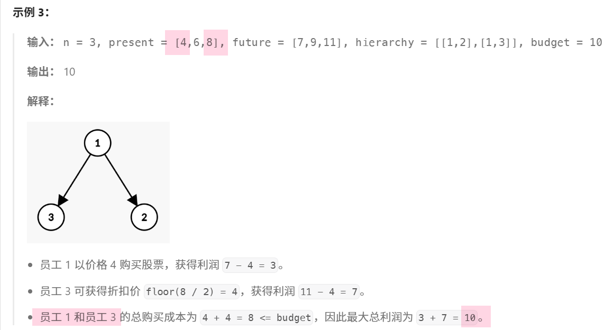

这是一个**树形背包 DP**问题，结合了==「依赖关系」和「折扣机制」==,我们直接结合示例3来理解



------

### **1. 问题建模（状态定义）**

- **状态含义**：`f[j][k]` 表示在子树 `x` 中，使用预算 `j`，且父节点状态为 `k` 时的最大利润。

- `k=0`：父节点**没买** → 当前节点 `x` **无折扣**（原价 `present[x]`）
- `k=1`：父节点**买了** → 当前节点 `x` **有 5 折**（价格 `present[x]/2`）

💡 为什么需要 `k`？因为题目规定：**只有父节点买了，子节点才能享受折扣**。

------

### **2. 状态转移**

分两步：

#### **(1) 合并子树结果（背包合并）**

- ==对每个子节点 `y`，将其所有可能的预算分配方案（`fy[jy][k]`）合并到当前节点 `x` 的 `sub_f[j][k]` 中==。
- 类似「分组背包」：每个子树是一组物品，必须选一种预算分配方式。

#### **(2) 决策当前节点（买 or 不买）**

- **不买** `x`：利润 = 子树最大利润（此时子节点视为「父节点没买」→ `sub_f[j][0]`）
- **买** `x`：利润 = 子树利润（子节点视为「父节点买了」→ `sub_f[j-cost][1]`） + `(future[x] - cost)`
  （`cost` 根据父节点状态 `k` 决定是原价还是半价）

------

### **3. 初始化**

- `sub_f` 初始全为 0（没有子节点时，利润为 0）
- 递归从叶子节点向上计算（后序遍历）

------

### **4. 遍历顺序**

- **DFS 后序遍历**：先处理所有子节点，==再处理当前节点（依赖子问题结果==）
- **背包逆序遍历**：`j` 从 `budget` 到 `0`，==避免重复选择同一子树==

------

### **5. 最终答案**

- `dfs(0)[budget][0]`：从根节点（0 号）出发，总预算 `budget`，且根节点**没有父节点**（视为 `k=0`，无折扣）

------

### 🌰 举个栗子

假设：

- 节点 0 是根，价格 10，未来价 15
- 节点 1 是子节点，价格 8，未来价 12
- 预算 = 12

**决策过程**：

1. 如果**不买根**：只能用 12 元买子节点（无折扣，价格 8），利润 = 12-8=4
2. 如果**买根**：花 10 元，剩余 2 元 → 子节点享受 5 折（价格 4），但钱不够 → 利润 = 15-10=5
   **最终选方案 2（利润 5）**

这就是==DP 在自动比较所有可能性==

```cpp
class Solution {
public:
    int maxProfit(int n, vector<int>& present, vector<int>& future, vector<vector<int>>& hierarchy, int budget) 
    {
        vector<vector<int>> g(n);
        for (auto& e : hierarchy) {
            g[e[0] - 1].push_back(e[1] - 1);
        }//建树-父指子

        auto dfs = [&](this auto&& dfs, int x) -> vector<array<int, 2>> 
        {
            // 计算从 x 的所有儿子子树 y 中，能得到的最大利润之和（x 不买，x 买）
            vector<array<int, 2>> sub_f(budget + 1);
            for (int y : g[x]) {
                auto fy = dfs(y);
                for (int j = budget; j >= 0; j--) {
                    // 枚举子树 y 的预算为 jy
                    // 当作一个体积为 jy，价值为 fy[jy][k] 的物品
                    for (int jy = 0; jy <= j; jy++) {
                        for (int k = 0; k < 2; k++) { 
                            // k=0 表示 x 不买，k=1 表示 x 买
                            sub_f[j][k] = max(sub_f[j][k], sub_f[j - jy][k] + fy[jy][k]);
                        }
                    }
                }
            }

            // 计算从子树 x 中，能得到的最大利润之和（x 父节点不买，x 父节点买）
            vector<array<int, 2>> f(budget + 1);
            for (int j = 0; j <= budget; j++) {
                for (int k = 0; k < 2; k++) { 
                    // k=0 表示 x 父节点不买，k=1 表示 x 父节点买
                    int cost = present[x] / (k + 1);
                    if (j >= cost) 
                    {
                        // 不买 x，转移来源是 sub_f[j][0]
                        // 买 x，转移来源为 sub_f[j-cost][1]，因为对于子树来说，父节点一定买
                        f[j][k] = max(sub_f[j][0], sub_f[j - cost][1] + future[x] - cost);
                    } 
                    else 
                    { 
                        // 只能不买 x
                        f[j][k] = sub_f[j][0];
                    }
                }
            }
            return f;
        };
        return dfs(0)[budget][0];
    }
};
```

